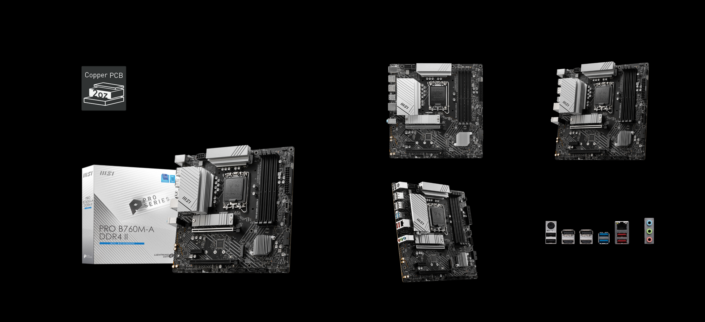
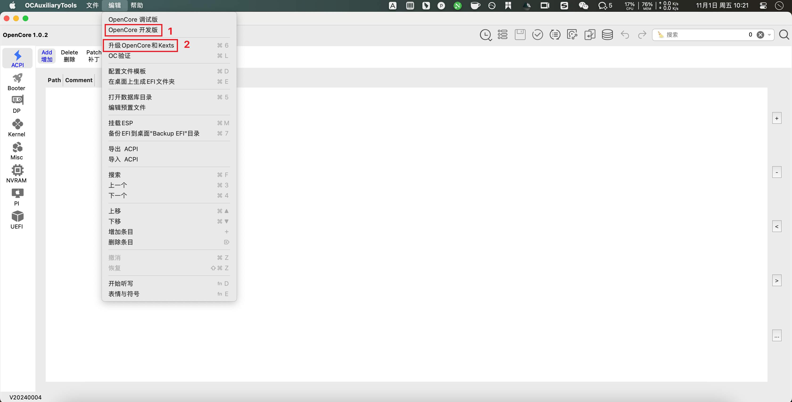
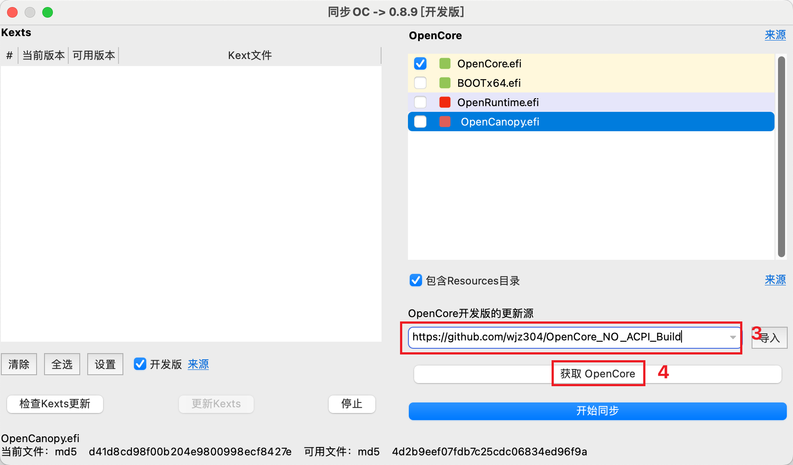
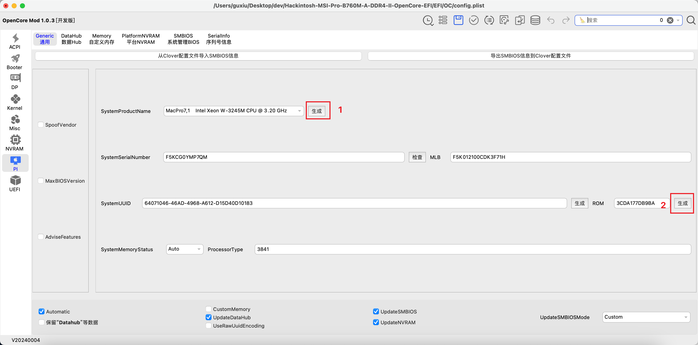

# Hackintosh MSI Pro B760M-A DDR4 II OpenCore EFI

参考xxnuo的 [Hackintosh-MSI-Pro-B760M-A-WIFI-DDR4-II-OpenCore-EFI](https://github.com/xxnuo/Hackintosh-MSI-Pro-B760M-A-WIFI-DDR4-II-OpenCore-EFI) 并结合自己实际情况修改，感谢作者无私奉献。

### 硬件

| 组件         | 规格                                                                        |
| ------------ | --------------------------------------------------------------------------- |
| 主板         | 微星 MSI Pro B760M-A DDR4 II (2 Gen)                                   |
| 处理器       | Intel i5-12600KF                                                            |
| 显卡         | 华擎（ASRock）AMD RADEON RX 6800XT 幻影电竞 OC 7nm AMD RDNA 2架构 16GB GDDR6 |
| 内存         | 玖合星舞 海力士CJR颗粒 64GB DDR4 3600 Mhz (16GBx4 XMP 3600Mhz)                 |
| 硬盘位1：MacOS / Windows   | 金士顿 Kingston KC3000 2TB                                               |
| 硬盘位2：Windows游戏使用 | 三星 PM9A1 2TB                                      |
| 声卡         | 板载瑞昱 Realtek ALC897                                                     |
| 有线网卡     | 板载瑞昱 Realtek RTL8125BG 2.5GbE LAN                                       |
| 无线网卡     | 无 |

### 其他

- 显示器: 4K
- 电源: 1000W

### 系统固件版本

| 组件     | 版本                                                | 备注                                                                                     |
| -------- | --------------------------------------------------- | ---------------------------------------------------------------------------------------- |
| BIOS     | 7D99v1B (2024-04-23)                                | [主板官方产品规格介绍](https://www.msi.cn/Motherboard/PRO-B760M-A-DDR4-II/Overview) |
| OpenCore | [1.0.2](https://github.com/acidanthera/OpenCorePkg) | 2024-10-16                                                                               |
| OpenCore Mod| [1.0.3](https://github.com/wjz304/OpenCore_NO_ACPI_Build) | 2024-10-23，由于双系统单盘原因，原版OC引导会导致Windows启动蓝屏报ACPI_BIOS_ERROR错误，改为Mod版正常                                                                               |
| macOS    | Sequoia 15.0 (24A335)                                 | [macOS All In One多系统安装镜像在线版包括:10.13-15.0,以及 FirPE1.9.1+Windows11](https://mp.weixin.qq.com/s/lUInPXMrJaL4T81C8GhSEg)                                |

### BIOS 设置

| 设置项   | 路径                                | 值       |
| -------- | ----------------------------------- | -------- |
| 安全启动 | Settings -> Security -> Secure Boot | Disabled |
| D.T.M    | Search -> D.T.M                     | Enabled  |

### 驱动列表

| 系统    | 软件                                                                                   | 说明                                              |
| ------- | -------------------------------------------------------------------------------------- | ------------------------------------------------- |
| macOS   | [OpenRGB](https://gitlab.com/CalcProgrammer1/OpenRGB)                                  | RGB 灯效控制软件，支持 MSI 主板 ARGB 风扇灯效控制 |
| Windows | [官方驱动软件](https://www.msi.cn/Motherboard/PRO-B760M-A-DDR4-II/support) | 主板官方驱动下载                                  |

### 使用说明

> 必须按说明生成你自己系统的序列号，否则可能影响 Apple 云服务的使用

1. 在 [Release](https://github.com/nocmt/Hackintosh-MSI-Pro-B760M-A-DDR4-II-OpenCore-EFI/releases) 下载最新的 `EFI.zip` 文件
2. 解压下载的 `EFI.zip` 文件到桌面
3. 下载并解压 [OCAuxiliaryTools](https://github.com/ic005k/OCAuxiliaryTools/releases)
4. 【可选】打开 OCAuxiliaryTools，点击菜单栏的`编辑`，启用`OpenCore开发版`，再选择 `升级OpenCore和Kexts`，将 `OpenCore：开发版的更新源`
改成 `https://github.com/wjz304/OpenCore_NO_ACPI_Build`，点击`获取OpenCore`，等待更新成功，再点击`开始同步`

5. 点击菜单栏的 `文件/打开`，选择 `桌面/EFI/OC/config.plist`
6. 选择左侧的 `PI` 选项卡，然后依次点击 1、`生成`；2、`生成`，最后`保存`即可

7. 关闭 OCAuxiliaryTools
8. **复制桌面上的 EFI 文件夹到你要安装 macOS 的硬盘的第一个引导分区根目录**
9. **复制桌面上的 EFI 文件夹到你用 DMG 镜像做好的安装 U 盘的第一个引导分区根目录**
10. 重启插上你用 DMG 镜像做好的安装 U 盘，进 BIOS 选择 U 盘启动，按步骤安装。
11. 安装完成后，拔掉安装 U 盘，重启即可进入系统。

### 其他资源

#### 软件

| 系统    | 软件                                                                                   | 说明                                              |
| ------- | -------------------------------------------------------------------------------------- | ------------------------------------------------- |
| macOS   | [MaciASL](https://gitlab.com/CalcProgrammer1/OpenRGB)                                  | 编辑ACPI文件的软件 |
| macOS | [Hackintool](https://github.com/benbaker76/Hackintool) | 黑苹果配置工具 |
| macOS、Windows | [RapidEFI-Tool](https://github.com/JeoJay127/RapidEFI-Tool) | 基于OpenCore的优秀一键式EFI配置工具 |
| Windows | [DiskGenius](https://www.diskgenius.cn/) | 磁盘编辑工具，也可修改UEFI启动项（BIOS也可以设置）                                  |
| Windows | [EasyUEFI](https://www.easyuefi.com/index-cn.html) | 轻松管理EFI/UEFI启动项 & 管理EFI系统分区 & 修复EFI系统启动问题！收费但可以试用|
| Windows | [transmac](https://www.easyuefi.com/index-cn.html) | USB烧录工具，在U盘目录打开镜像文件选择还原就可以用，感觉比etcher稳定，不会报错，收费但可以试用15天|
| Windows | [USBToolBox](https://github.com/USBToolBox/tool) | USB 接口发现及 USBMap.kext 生成工具|

#### 教程

1、[FEVM FN60G黑苹果兼Sequoia安装教程|黑果小兵的部落阁](https://blog.daliansky.net/FEVM-FN60G-Hackintosh-and-Sequoia-Installation-Tutorial.html#more)

2、[国光的黑苹果安装教程：手把手教你配置 OpenCore](https://apple.sqlsec.com/)

3、[台式机黑苹果如何屏蔽不支持的NVIDIA独立显卡和PM981？](https://heipg.cn/tutorial/block-nv-dgpu-or-pm981.html)